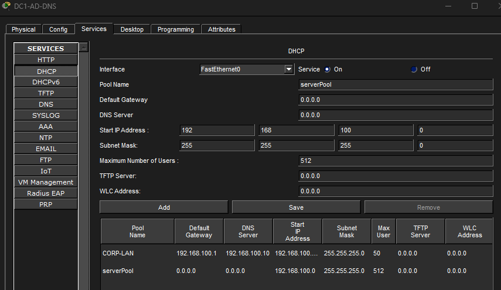

# DHCP and DNS Configuration
## Overview

This section documents the configuration and verification of DHCP and DNS services within the Cisco Hybrid Enterprise Network Lab.

DHCP was implemented to automatically assign IP addresses to wireless end devices including laptops and smartphones.

DNS configuration was used to demonstrate name resolution and network service communication within the simulated enterprise environment.

## DHCP Configuration

Dynamic Host Configuration Protocol (DHCP) was used to automatically provide network configuration information to wireless and mobile end devices.

DHCP assignment includes:

- IP Address
- Subnet Mask
- Default Gateway
- DNS Server Information

The following devices receive IP addresses dynamically:

| Device | Device Type | Assignment Method | Department |
|---|---|---|---|
| Sales-Laptop1 | Laptop | DHCP | Sales |
| Management-Laptop1 | Laptop | DHCP | Management |
| HelpDesk-Laptop1 | Laptop | DHCP | Help Desk |
| IT-Smartphone1 | Smartphone | DHCP | IT |
| HR-Smartphone1 | Smartphone | DHCP | HR |
| Sales-Smartphone1 | Smartphone | DHCP | Sales |
| Management-Smartphone1 | Smartphone | DHCP | Management |
| HelpDesk-Smartphone1 | Smartphone | DHCP | Help Desk |

## DHCP Server Configuration

DHCP services were configured on the network server to automatically assign IP addressing information to client devices.

The DHCP service provides:

- IP address assignment
- Subnet mask configuration
- Default gateway information
- DNS server information

